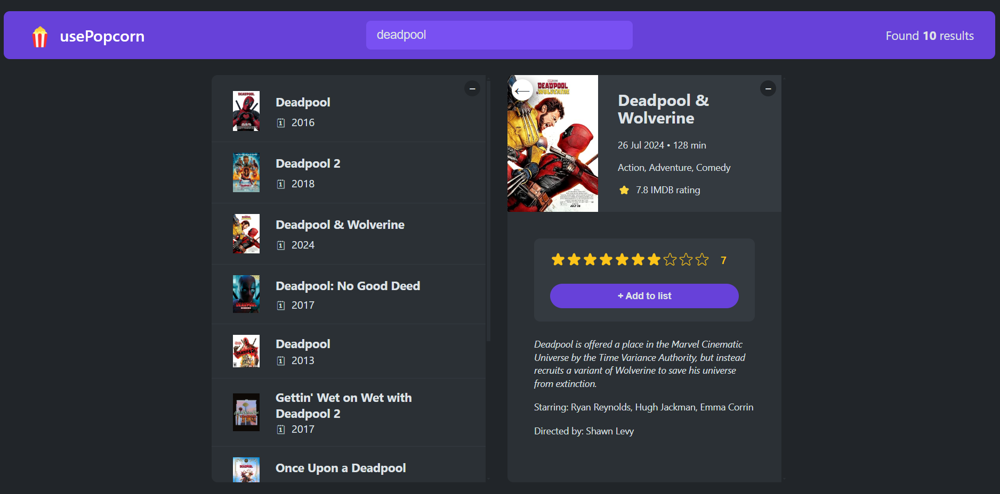

# UsePopCorn



A React app for searching, rating, and saving ratings for movies you've watched.

## Live Demo

[View the project live here](https://usepopcorn-abdousadik.netlify.app/).

---

## Table of Contents

- [Description](#description)
- [Technologies](#technologies)
- [Getting Started](#getting-started)
- [References](#references)

---

## Description

UsePopCorn is a React application designed to enhance your movie-watching experience. With this app, you can:

- Use a search bar to look up movies from a comprehensive API.
- Rate your favorite or recently watched movies.
- Store and manage your ratings using local storage, ensuring they are saved even after closing the browser.

---

## Technologies

This project was built using:

- **React**

---

## Getting Started

To get started with the UsePopCorn project, follow these steps:

1. Clone the repository:

   ```bash
   git clone https://github.com/abdousadik/usepopcorn-movies.git
   ```

2. Navigate to the project directory:

   ```bash
   cd usepopcorn-movies
   ```

3. Install the necessary dependencies:

   ```bash
   npm i
   ```

4. Start the development server:

   ```bash
   npm run start
   ```

5. Open your browser and visit:
   ```
   http://localhost:3000
   ```

---

## License

This project is licensed under the MIT License. See the LICENSE file for further details.

---
